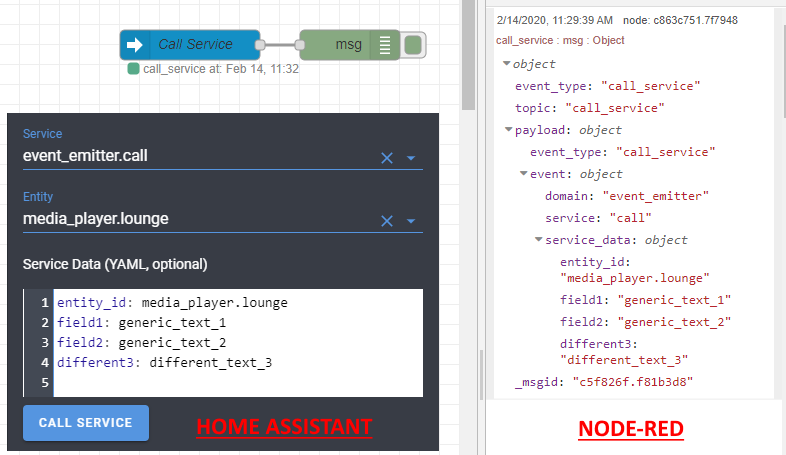

# Event Emitter

## Custom Component For Home Assistant

[![gh_release][gh_release]](event-emitter/releases)
[![gh_last_commit][gh_last_commit]](../../commits/master)
[![hacs_custom][hacs_custom]](https://github.com/custom-components/hacs)

This component creates a service `event_emitter.call` that lets you emit a call-service event. This can be used to pass Service data between components such as to Node Red.

There is no restirction on parameters allowing total flexibility.




## Install
1. Install with [HACS](https://github.com/custom-components/hacs) or copy the `custom_components` folder in your HA configuration folder.
2. Add
    ```
    event_emitter:
    ```
    to the `configuration.yaml`

## Example Service Parameters
- `entity_id`: Example entity id   (eg. `media_player.lounge`) [optional]
- `field1`: Generic field 1
- `field2`: Generic field 2
- `different3`: Different feld 3

[hacs_custom]: https://img.shields.io/badge/HACS-Custom-orange.svg?style=for-the-badge
[gh_release]: https://img.shields.io/github/v/release/jeremywillans/event-emitter.svg?style=for-the-badge
[gh_last_commit]: https://img.shields.io/github/last-commit/jeremywillans/event-emitter.svg?style=for-the-badge