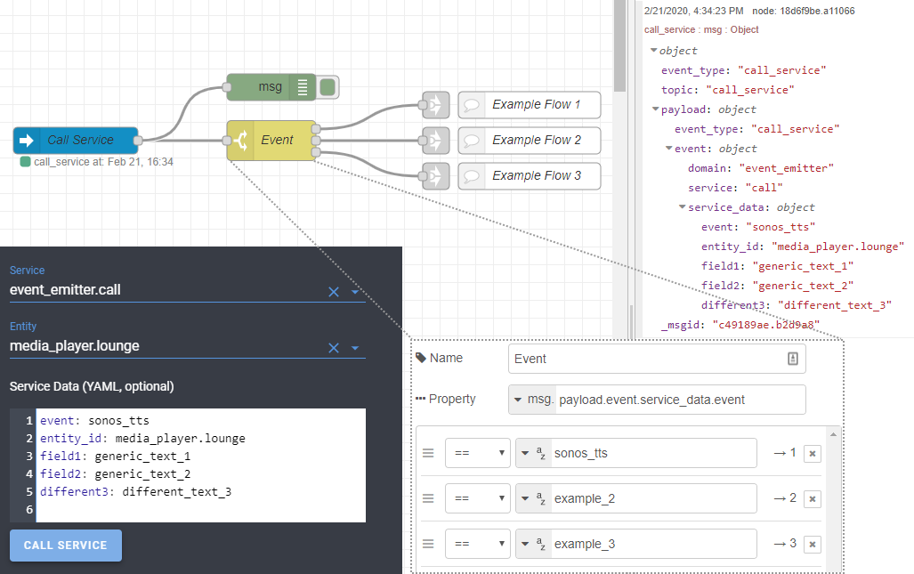

# Event Emitter

## Custom Component For Home Assistant

[![gh_release][gh_release]](../../releases)
[![gh_last_commit][gh_last_commit]](../../commits/master)
[![hacs_custom][hacs_custom]][hacs]

This component creates a service `event_emitter.call` that lets you emit a call-service event. This can be used to pass Service data between components such as from the Lovelace UI to Node Red.

There is no restirction on parameters allowing total flexibility.

In the below use-case example, a service data field `event` is used to route flows in Node Red.




## Install
1. Install with [HACS](https://github.com/custom-components/hacs) or copy the `custom_components` folder in your HA configuration folder.
2. Add
    ```
    event_emitter:
    ```
    to the `configuration.yaml`

## Example Service Parameters
- `entity`: Example Event ID (eg. `sonos_tts`)
- `entity_id`: Example entity id   (eg. `media_player.lounge`) [optional]
- `field1`: Generic field 1
- `field2`: Generic field 2
- `different3`: Different feld 3

## Support

In case you've found a bug, please [open an issue on GitHub](../../issues).

## My Repos

[ha-rest980-roomba] | 
[roomba-vacuum-card] | 
[hass-addons] | 
[event-emitter]

[![BMC]](https://www.buymeacoffee.com/jeremywillans)

[gh_release]: https://img.shields.io/github/v/release/jeremywillans/event-emitter.svg?style=for-the-badge
[gh_last_commit]: https://img.shields.io/github/last-commit/jeremywillans/event-emitter.svg?style=for-the-badge
[hacs_custom]: https://img.shields.io/badge/HACS-Custom-orange.svg?style=for-the-badge
[hacs]: https://github.com/custom-components/hacs

[ha-rest980-roomba]: https://github.com/jeremywillans/ha-rest980-roomba
[roomba-vacuum-card]: https://github.com/jeremywillans/lovelace-roomba-vacuum-card
[hass-addons]: https://github.com/jeremywillans/hass-addons
[event-emitter]: https://github.com/jeremywillans/event-emitter
[BMC]: https://www.buymeacoffee.com/assets/img/custom_images/white_img.png